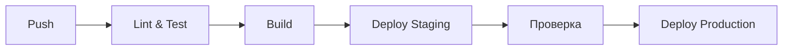

# 8. Деплой

## Окружения

| Окружение | URL | Назначение |
|-----------|-----|-----------|
| Development | localhost:3000 | Локальная разработка |
| Staging | | Тестирование перед релизом |
| Production | | Продакшен |

## Стратегия деплоя
<!-- Blue-Green / Rolling / Canary -->

## CI/CD Pipeline



### Этапы пайплайна

1. **Lint & Format** — проверка стиля кода
2. **Тесты** — запуск unit и интеграционных тестов
3. **Сборка** — сборка production-бандла
4. **Деплой на staging** — автоматический деплой
5. **Smoke-тесты** — проверка критических функций
6. **Деплой на production** — ручное подтверждение

## Хостинг

| Сервис | Назначение |
|--------|-----------|
| | Frontend |
| | Backend |
| | База данных |
| | Файловое хранилище |

## Конфигурация

### Docker
```dockerfile
# Пример Dockerfile
FROM node:20-alpine
WORKDIR /app
COPY package*.json ./
RUN npm ci --only=production
COPY . .
RUN npm run build
EXPOSE 3000
CMD ["npm", "start"]
```

### docker-compose
```yaml
version: '3.8'
services:
  app:
    build: .
    ports:
      - "3000:3000"
    env_file:
      - .env
```

## Чек-лист деплоя
- [ ] Все тесты пройдены
- [ ] Миграции БД применены
- [ ] Переменные окружения настроены
- [ ] SSL сертификат актуален
- [ ] Бэкап БД создан
- [ ] Мониторинг настроен

---
*Дата создания: 2026-03-05*
