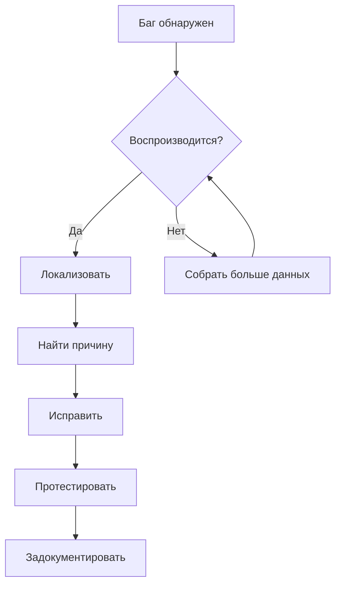

# 9. Дебагинг

## Инструменты отладки

| Инструмент | Назначение |
|-----------|-----------|
| Chrome DevTools | Отладка фронтенда |
| VS Code Debugger | Отладка кода |
| Postman | Отладка API |
| Docker logs | Логи контейнеров |

## Логирование

### Уровни логов
| Уровень | Описание | Пример |
|---------|----------|--------|
| ERROR | Критические ошибки | Падение сервера |
| WARN | Предупреждения | Устаревший API |
| INFO | Информация | Запуск сервера |
| DEBUG | Отладочная информация | Значения переменных |

### Настройка логирования
```javascript
// Пример настройки логгера
const logger = {
  level: process.env.LOG_LEVEL || 'info',
  format: 'json',
  output: ['console', 'file']
};
```

## Типичные ошибки и решения

### Frontend

| Ошибка | Причина | Решение |
|--------|---------|---------|
| CORS error | Неверная настройка CORS | Настроить заголовки на сервере |
| 404 на рефреш SPA | Не настроен fallback | Добавить редирект на index.html |
| Утечка памяти | Не очищенные подписки | Использовать cleanup в useEffect |

### Backend

| Ошибка | Причина | Решение |
|--------|---------|---------|
| 500 Internal Error | Необработанное исключение | Добавить try/catch, middleware |
| Connection refused | БД не запущена | Проверить подключение к БД |
| Timeout | Долгий запрос | Оптимизировать запрос, добавить индексы |

## Мониторинг

### Метрики для отслеживания
- [ ] Время ответа сервера
- [ ] Использование CPU / RAM
- [ ] Количество ошибок
- [ ] Активные подключения

### Сервисы мониторинга
| Сервис | Назначение |
|--------|-----------|
| | Error tracking |
| | APM (Application Performance) |
| | Uptime monitoring |

## Процесс отладки



---
*Дата создания: 2026-03-05*
